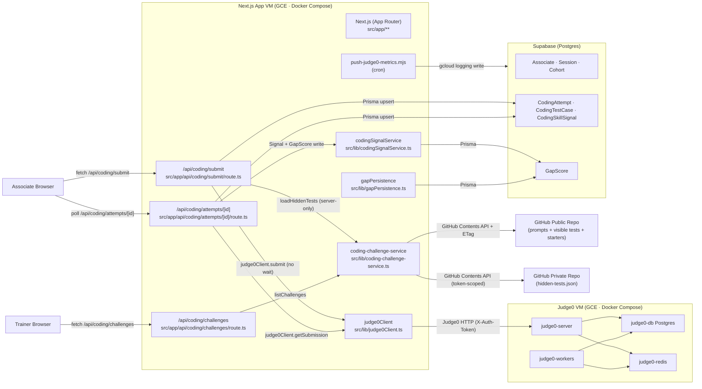

# Architecture — Next Level Mock

**Version:** v1.4 (Coding Challenges + Multi-Language Sandbox)
**Last updated:** 2026-04-18

## Overview

Next Level Mock is an adaptive technical skills platform. Associates practice
via mock interviews (trainer-led or AI-automated) and, as of v1.4, coding
challenges across Python, JavaScript, TypeScript, Java, SQL, and C#. The
platform adapts to each associate's gaps, classifies readiness
(ready / improving / not_ready), and gives trainers a roster-level dashboard.
See `PROJECT.md` for product context.

## v1.4 Coding Stack Diagram

## Component Responsibilities

- `src/lib/judge0Client.ts` (Phase 38 D-11) — thin HTTP client for Judge0 with
  1-retry on 5xx / AbortError, no retry on 4xx, X-Auth-Token header,
  never uses `wait=true`.
- `src/lib/judge0Errors.ts` — typed error surface
  (`UnsupportedLanguageError`, `Judge0UnavailableError`, `Judge0ConfigError`).
- `src/app/api/coding/submit/route.ts` (Phase 39) — auth gate + rate limit +
  hidden-test injection + per-test Judge0 submission (async). Never echoes
  hidden test fixtures to the client.
- `src/app/api/coding/attempts/[id]/route.ts` (Phase 39) — polls Judge0 via
  `codingAttemptPoll`, normalizes verdicts, writes the CodingSkillSignal +
  GapScore fire-and-forget.
- `src/app/api/coding/challenges/route.ts` (Phase 39) — manifest listing
  scoped to associate cohort + curriculum.
- `src/lib/coding-challenge-service.ts` (Phase 37) — two-repo loader with
  ETag-aware GitHub fetches; hidden-test load is server-only.
- `src/lib/coding-bank-schemas.ts` (Phase 37) — Zod schemas for meta / tests /
  starters. Imported by both the server loader and the
  `validate-challenge` CLI (T-44-05 mitigation — single source of truth).
- `src/lib/codingSignalService.ts` (Phase 36 / 41) — verdict → skill-signal
  math (D-16 weight table).
- `src/lib/gapPersistence.ts` (Phase 41) — `persistCodingSignalToGapScore`
  with difficulty multipliers (easy 0.7 / medium 1.0 / hard 1.3).
- `iac/gce-judge0/judge0-vm.tf` (Phase 43; reference template only in v1.5 —
  relabeled from `infra/terraform/` in Phase 50) — dedicated GCE host for
  Judge0; private VPC; firewall rules restrict ingress to the App VM. v1.5
  prod uses `iac/cloudrun/` instead; see `iac/cloudrun/judge0.tf.disabled`
  for the v1.6 Judge0 reactivation plan.
- `scripts/push-judge0-metrics.mjs` (Phase 43 D-11) — queue-depth + latency
  metrics cron → Cloud Logging.
- `.github/workflows/deploy-app.yml` / `deploy-judge0.yml` (Phase 43) — CI/CD
  deploy pipelines.
- `scripts/validate-challenge.ts` (Phase 44 D-13) — local CLI wrapping the
  Phase 37 validator for trainer pre-PR checks.
- `scripts/load-test-coding.ts` / `scripts/abuse-test-coding.ts` (Phase 44
  HARD-01 / HARD-02) — production-readiness gating harnesses.

## Data Flow — Submission Lifecycle

1. Associate clicks **Submit** in `/coding/<slug>` editor.
2. Browser → `POST /api/coding/submit` with `{ challengeId, language, code }`.
3. Route enforces: auth (associate identity), rate limit, cohort-curriculum
   match, language allowlist, payload size cap (100 KB).
4. Route calls `loadHiddenTests(slug)` against the **private** GitHub repo —
   server-only edge, never exposed to the client.
5. `judge0Client.submit` is called once per test case (no wait), tokens are
   stored on the `CodingAttempt` row.
6. Route returns `{ attemptId }`.
7. Browser polls `GET /api/coding/attempts/[id]` every N ms.
8. Poll route fetches verdicts from Judge0, normalizes per
   `judge0Verdict.ts`, and writes per-test results + overall verdict.
9. On final verdict, `codingSignalService` writes a `CodingSkillSignal` and
   (fire-and-forget) `persistCodingSignalToGapScore` updates the associate's
   gap score.
10. `GapScore` recompute triggers the readiness pipeline (unchanged from v1.3).
11. UI re-renders the verdict + visible-test results.

## Trust Boundaries

- **Browser ↔ App VM** — Supabase-authenticated requests; cookies + bearer
  tokens.
- **App VM ↔ Judge0 VM** — private VPC; `X-Auth-Token` (Phase 38). Judge0
  port 2358 never exposed to the public internet.
- **App VM ↔ Supabase** — Prisma via Transaction Pooler (port 6543). RLS
  active as defense-in-depth (Phase 20).
- **App VM ↔ GitHub** — public repo fetches use `GITHUB_TOKEN`; hidden-test
  fetches use `GITHUB_CODING_PRIVATE_TOKEN`. Server-only modules (see
  `coding-challenge-service.ts` top comment).
- **Judge0 sandbox ↔ host** — Phase 38 D-04..D-07 caps: `enable_network=false`,
  `max_processes=60`, `max_cpu_time_limit=10`, `max_memory_limit=256000 KB`,
  `max_file_size=8192 KB`. Verified by `scripts/abuse-test-coding.ts`.
- **Hidden tests ↔ client** — `CODING-API-02` enforces hidden-test fixtures
  are never surfaced in any client-reachable response body; only pass/fail
  counts.

## Production Readiness Evidence

- [44-LOAD-TEST-REPORT.md](./.planning/phases/44-hardening-load-test/44-LOAD-TEST-REPORT.md) —
  50-concurrent load test per D-03 thresholds (p95 ≤ 10 s; queue depth
  bounded; VM CPU headroom).
- [44-ABUSE-TEST-REPORT.md](./.planning/phases/44-hardening-load-test/44-ABUSE-TEST-REPORT.md) —
  6-payload-class containment evidence with docker stats sampling (no cgroup
  escape).
- [44-CSO-REPORT.md](./.planning/phases/44-hardening-load-test/44-CSO-REPORT.md) —
  STRIDE-scoped security audit covering Phases 38 + 39 + 43.
- [44-CODEX-ADVERSARIAL-REPORT.md](./.planning/phases/44-hardening-load-test/44-CODEX-ADVERSARIAL-REPORT.md) —
  codex adversarial-review on the same diff scope.
- Note — Reports are produced by the harnesses against the Phase 43-deployed
  stack; see `44-LOAD-TEST-CHECKPOINT.md` for the human checklist and the
  report-generation procedure.

## Related Docs

- [PROJECT.md](./.planning/PROJECT.md) — product context, readiness math,
  milestone history.
- [CLAUDE.md](./CLAUDE.md) — agent workflow + code conventions.
- [DESIGN.md](./DESIGN.md) — token layer + visual system.
- [docs/trainer-authoring.md](./docs/trainer-authoring.md) — how trainers
  author new coding challenges.
- [docs/runbooks/coding-stack.md](./docs/runbooks/coding-stack.md) (Phase 43
  D-13) — operator runbook for the Judge0 stack.
- [docs/coding-bank-schema.md](./docs/coding-bank-schema.md) (Phase 37) —
  schema reference for the challenge bank.
